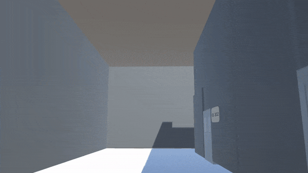

# MASF: Monitoring Assistant in Medical Field

  &nbsp;&nbsp;&nbsp;&nbsp;&nbsp;&nbsp;&nbsp;&nbsp;&nbsp;&nbsp;&nbsp;&nbsp;&nbsp;&nbsp;&nbsp;&nbsp;&nbsp;&nbsp;&nbsp;&nbsp;&nbsp;&nbsp;&nbsp;&nbsp;
 
Repository to show the [eXtended Reality Spring School 2022](https://www.xrsalento.it/school/) final project. 

The code here available and the [presentation]() were equally made by:
  * [Eros Viola](https://www.linkedin.com/in/eros-viola-2245901ba/);
  * [Lorenzo Stacchio](https://lorenzo-stacchio.github.io/);
  * [Sabatina Criscuolo](https://www.linkedin.com/in/sabatina-criscuolo/);

## Project description
MASF stands for Monitoring Assistant in Medical Field and take inspiration from starts from the idea to have an Augmented Reality (AR) assistance to support medical figures, such as nurses and surgeons. 

Indeed, during surgical procedures, in pre-post procedure phases or while taking care of a patient, AR paradigms could ease the work of many different medical workers by retrieve and visualizing, for example :

  * patient’s vitals acquired from the electromedical equipment, without having to turn around and look at instrumentation;
  * patient's anamnesis;
  * indication on medications to administate to the patient;
  * ... 

To give an idea on how this Augmented Reality system could work, we simulate in Virtual Reality a typical hospital scenario providing implementation for the first two use-cases previously introduced while using simulated data.

## Summing-up the demo with a GIF

  &nbsp;&nbsp;&nbsp;&nbsp;&nbsp;&nbsp;&nbsp;&nbsp;&nbsp;&nbsp;&nbsp;&nbsp;&nbsp;&nbsp;&nbsp;&nbsp;&nbsp;&nbsp;&nbsp;&nbsp;&nbsp;&nbsp;&nbsp;&nbsp;
